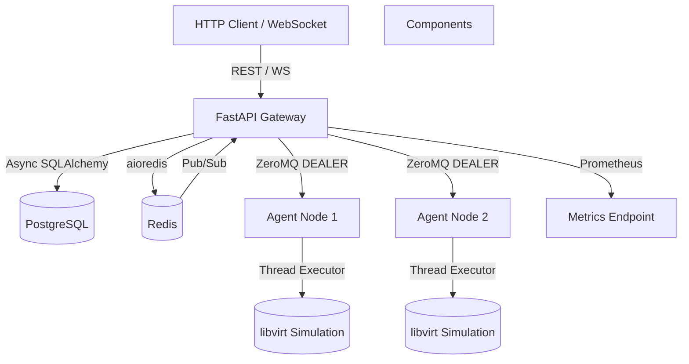

# Architecture Overview

KVM Light Manager follows a microservices architecture with clear separation between the API Gateway and the Agent fleet. All communication is asynchronous and designed for horizontal scalability.

## High‑Level Diagram


1. API Gateway (FastAPI)
Serves REST endpoints and WebSocket connections.
```
Manages VM lifecycle via asynchronous background tasks.

Communicates with Agents using ZeroMQ DEALER‑ROUTER pattern.

Stores VM metadata in PostgreSQL using SQLAlchemy 2.0 async ORM.

Uses Redis for:

Storing provisioning logs (list per VM)

Publishing log updates to WebSocket clients via Pub/Sub
```
2. Agent Service
Simulates KVM/libvirt operations (disk cloning, domain define, power control).
```
Listens on a ZeroMQ ROUTER socket for requests.

Offloads blocking operations (simulated I/O) to a thread pool using asyncio.to_thread().

Returns structured responses with status (success/error) and optional data.
```
3. PostgreSQL
Persistent storage for VM metadata.
```
Schema managed by Alembic migrations.
```
4. Redis
Ephemeral log storage (keeps last 1000 entries per VM).
```
Pub/Sub broker for real‑time log streaming.
```
Communication Flow: VM Creation
Client sends POST /vms with desired specifications.

Gateway creates a database record with status=pending and a unique task_id.

Gateway launches a background asyncio.Task to handle provisioning.

Background task sends a provision request via ZeroMQ to an Agent.

Agent simulates disk cloning and VM definition using thread executor.

Agent replies with success or failure.

Gateway updates VM status in database and publishes final logs.

During provisioning, progress logs are written to Redis and streamed to any connected WebSocket client.

ZeroMQ Pattern: DEALER (API) ↔ ROUTER (Agent)
DEALER socket (API): Sends requests asynchronously; receives replies in order.

ROUTER socket (Agent): Receives an envelope (identity + empty frame) and routes replies back.

This pattern supports multiple API instances talking to multiple Agents (with a proxy or direct connection).

Handling Blocking Operations (GIL Awareness)
All simulated libvirt calls are wrapped in asyncio.to_thread(), which runs the blocking function in a separate thread using the default ThreadPoolExecutor. This prevents the event loop from stalling, ensuring high concurrency even when dealing with legacy C extensions.

Resilience Patterns
Circuit Breaker: Protects against cascading failures when Agents are unresponsive.

Retries with Exponential Backoff: Automatically retries transient failures (timeouts, temporary unavailability).

Graceful Shutdown: Background tasks are tracked and allowed to complete (with a timeout) before the API process exits.

Observability
Structured JSON Logging: Each log entry includes a correlation_id for end‑to‑end tracing.

Prometheus Metrics: Request count, latency histograms, and custom business metrics.

Health Endpoints: /health/live, /health/ready, /health/status for orchestration platforms (Kubernetes).

Deployment
All services are containerised with Docker and orchestrated via Docker Compose for development. Production deployments can use Kubernetes with separate deployments for API and Agents.

Security Considerations
Optional API key authentication (header X-API-Key).

Internal ZeroMQ communication is unencrypted by design (intended for private networks); use network policies or TLS‑enabled ZMQ in production.

Database credentials and secrets should be injected via environment variables or a secrets manager.

Performance Characteristics
Concurrency: Asynchronous design allows thousands of simultaneous connections.

Throughput: Limited primarily by database and agent I/O; each agent can handle tens of provisioning tasks concurrently (simulated delays).

Latency: Provisioning is backgrounded; API response times are sub‑10ms for status checks.

Future Enhancements
Agent discovery via service registry (Consul, etcd).

Support for multiple hypervisor backends (VMware, Xen).

Live migration simulation.

Resource quota management.
